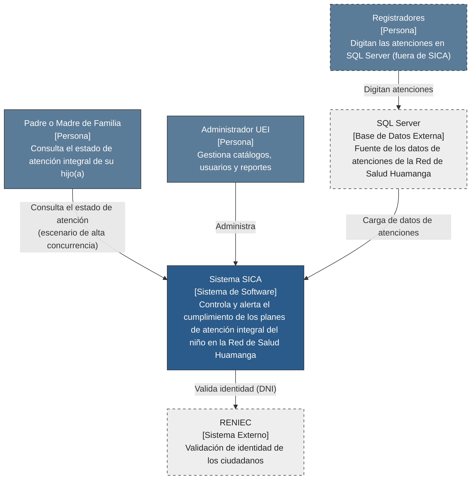
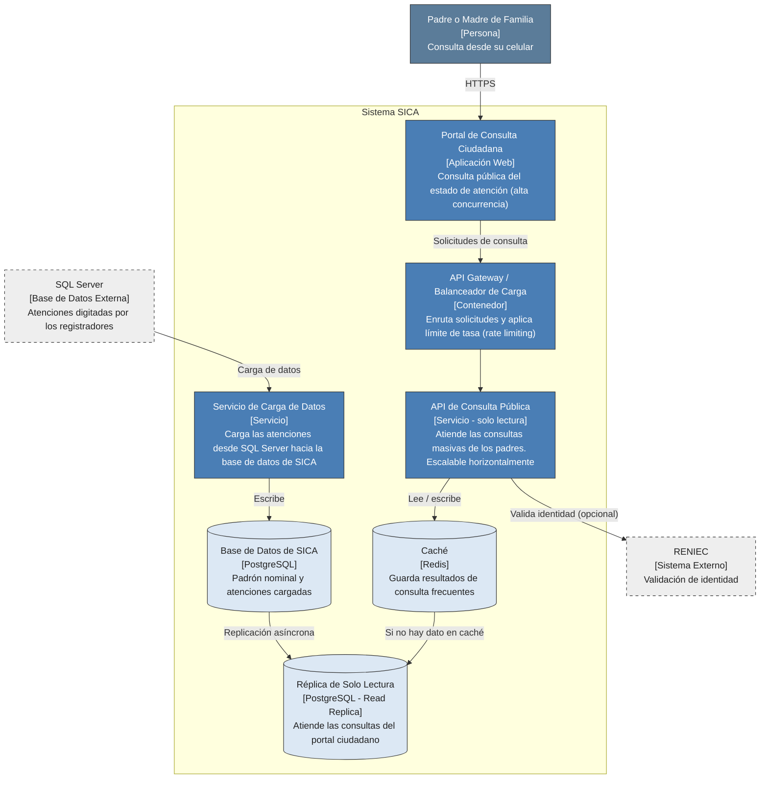
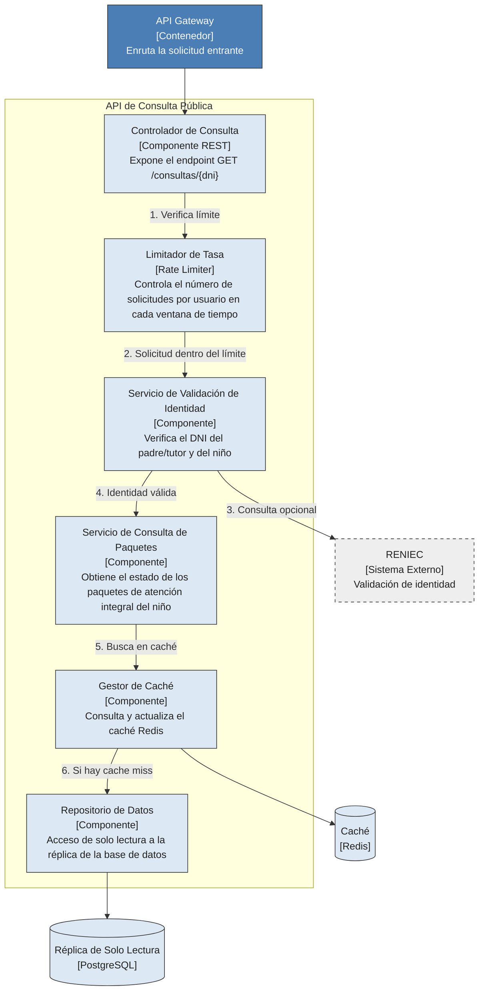

# Arquitectura inicial del sistema

Se documenta con el modelo **C4** (Simon Brown), desarrollando los tres primeros niveles: Contexto, Contenedores y Componentes. El nivel 4 (Código) no se desarrolla por corresponder a detalle de implementación.

## Nivel 1: Diagrama de Contexto

El sistema SICA se sitúa frente a dos tipos de usuario (padres o tutores y administrador de la UEI) y dos sistemas externos: **SQL Server**, fuente de las atenciones, y **RENIEC**, para validar identidad. Los registradores no usan SICA: digitan las atenciones directamente en SQL Server, y SICA las incorpora mediante una carga de datos. La relación entre el padre de familia y el sistema es el punto donde se concentra el escenario de alta concurrencia.

## Nivel 2: Diagrama de Contenedores

El **Portal de Consulta Ciudadana** envía las solicitudes al **API Gateway**, que las enruta a la **API de Consulta Pública** (solo lectura, escalable horizontalmente). Esta se apoya en **Redis** y en una **réplica de solo lectura** de la base de datos. Por otro lado, el **Servicio de Carga de Datos** trae las atenciones desde **SQL Server** y las escribe en la base de datos de SICA, que se replica a la réplica de lectura. Así, los picos de consulta no compiten por recursos con la carga de datos.

## Nivel 3: Diagrama de Componentes (API de Consulta Pública)

Se hace zoom sobre la API de Consulta Pública por ser el contenedor que concentra el escenario de alta concurrencia. Ante un incremento de tráfico solo es necesario escalar este contenedor, sin afectar el resto del sistema.
