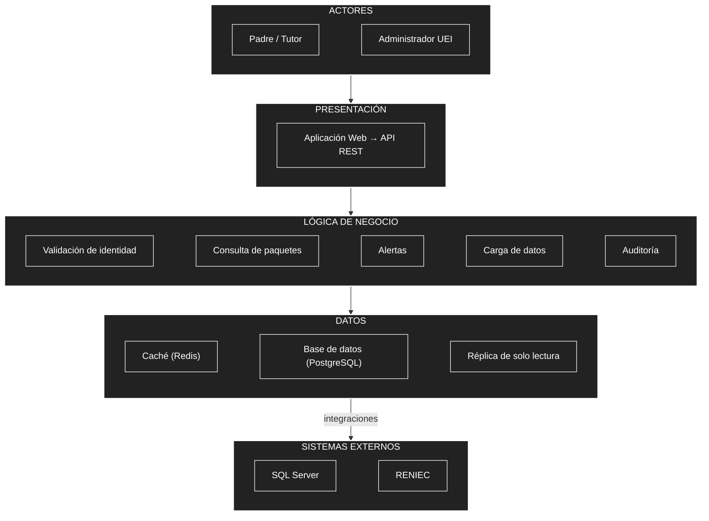

# Arquitectura inicial del sistema

## Diagrama de arquitectura

## Descripción

La arquitectura inicial se organiza en tres capas principales:

* **Presentación:** permite la interacción de los usuarios con el sistema mediante la aplicación web y la API REST.
* **Lógica de negocio:** contiene los módulos responsables de las funcionalidades del sistema: validación de identidad, consulta de paquetes de atención, alertas de atenciones pendientes, carga de datos y auditoría de consultas.
* **Datos:** almacena y sirve la información mediante una base de datos PostgreSQL, una réplica de solo lectura para las consultas masivas y un caché (Redis) que reduce la carga sobre la base de datos.

Además, el módulo de **Validación de identidad** se integra con **RENIEC** para verificar el DNI, y el módulo de **Carga de datos** obtiene las atenciones desde **SQL Server**, donde los registradores digitan la información fuera de SICA.

El detalle de contenedores y componentes de esta arquitectura se documenta en [`arquitectura-c4.md`](arquitectura-c4.md) y el flujo de una consulta en [`flujo-consulta.md`](flujo-consulta.md).