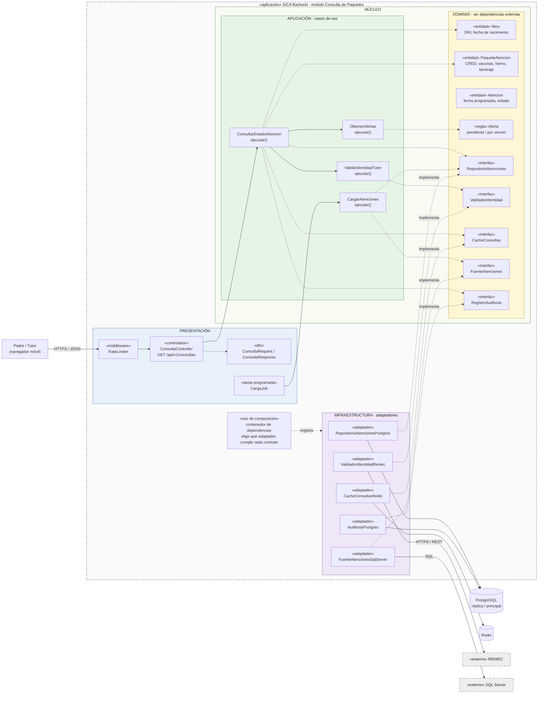

# Enfoque arquitectónico: Clean Architecture

Mientras el [estilo arquitectónico](../estilo-arquitectonico.md) define la forma global del sistema (monolito modular en capas), el **enfoque** define cómo se organizan las responsabilidades y las dependencias **dentro** de cada módulo.

| **Elemento** | **Descripción aplicada a SICA** |
|--------------|---------------------------------|
| **Patrón / enfoque arquitectónico** | Clean Architecture (Arquitectura Limpia). |
| **Objetivo** | Separar responsabilidades y controlar que las dependencias apunten siempre hacia el dominio. |
| **¿Qué problema resuelve?** | Evita el acoplamiento entre el portal web, las reglas de atención integral del niño y las tecnologías externas: PostgreSQL, Redis, SQL Server y RENIEC. |
| **Capas definidas** | Presentación, Aplicación, Dominio e Infraestructura. |
| **Decisión que lo respalda** | [ADR-002](../../analisis-de-sistema/07-decisiones-arquitectonicas.md#adr-002-clean-architecture) |
| **Drivers que atiende** | DA07 – Mantenibilidad, DA08 – Evolución modular, DA05 – RENIEC, DA06 – Carga desde SQL Server. |
| **Beneficios** | • Facilita el mantenimiento y las pruebas unitarias del dominio sin base de datos ni red.<br/>• Permite cambiar implementaciones técnicas (Redis, RENIEC, SQL Server) sin modificar las reglas del negocio.<br/>• Mejora la organización y la separación de responsabilidades del código. |

## Capas y responsabilidades

| **Capa** | **¿Qué contiene?** | **Ejemplo en SICA** | **Depende de** |
|----------|--------------------|---------------------|----------------|
| **Dominio** | Entidades, reglas de negocio y contratos (puertos). | `Nino`, `Tutor`, `PaqueteAtencion`, `Atencion`, `Alerta`; regla "una atención está por vencer si faltan ≤ 7 días"; interfaces `RepositorioAtenciones`, `ValidadorIdentidad`. | Nada |
| **Aplicación** | Casos de uso que orquestan el dominio. | `ConsultarEstadoAtencion`, `ValidarIdentidadTutor`, `ObtenerAlertas`, `CargarAtenciones`, `RegistrarConsulta`. | Dominio |
| **Infraestructura** | Adaptadores que implementan los contratos con tecnologías concretas. | `RepositorioAtencionesPostgres`, `CacheConsultasRedis`, `ValidadorIdentidadReniec`, `FuenteAtencionesSqlServer`, `AuditoriaPostgres`. | Dominio (implementa sus contratos) |
| **Presentación** | Entrada al sistema: controladores REST, DTOs, middlewares, tareas programadas. | `ConsultaController` (`GET /api/v1/consultas`), `CargaJob`, `RateLimiterMiddleware`. | Aplicación |

## Diagrama del enfoque



**Leyenda:** flecha continua = llamada en tiempo de ejecución; flecha punteada = dependencia de código (siempre apunta hacia el centro); «implementa» = el adaptador implementa un contrato definido en el dominio (inversión de dependencias).

**Anillos:** Dominio ⊂ Aplicación ⊂ Presentación / Infraestructura.

## Regla de dependencia

1. El **Dominio** no importa nada de las capas externas (ni PostgreSQL, ni Redis, ni RENIEC, ni el framework web).
2. Los **casos de uso** solo conocen entidades y contratos del dominio.
3. Los **adaptadores** implementan los contratos y son intercambiables (por ejemplo, `CacheConsultasRedis` ↔ `CacheConsultasMemoria` en pruebas; `ValidadorIdentidadReniec` ↔ `ValidadorIdentidadSimulado` en desarrollo).
4. Cambiar de tecnología = cambiar el adaptador registrado en la **raíz de composición**, no el dominio.

## Flujo de una consulta pública (HU01 / HU02)

1. El padre envía su DNI y el del niño → `RateLimiter` verifica el límite (RF-05).
2. `ConsultaController` convierte la petición en `ConsultaRequest` e invoca `ConsultarEstadoAtencion`.
3. El caso de uso llama a `ValidarIdentidadTutor`, que usa el contrato `ValidadorIdentidad` (implementado por el adaptador RENIEC) (RF-02).
4. Busca el resultado en `CacheConsultas`; si no existe, lo lee mediante `RepositorioAtenciones` (réplica PostgreSQL) y lo guarda en caché (AC01).
5. Las entidades `PaqueteAtencion` y `Alerta` aplican las reglas de cumplimiento y vencimiento (RF-03, RF-04).
6. Se registra la consulta mediante `RegistroAuditoria` (RF-07).
7. El controlador devuelve `ConsultaResponse` en JSON al portal responsivo (RF-08).

## Estructura de carpetas propuesta

```text
sica-backend/
├── src/
│   ├── modulos/
│   │   ├── consulta/
│   │   │   ├── dominio/
│   │   │   │   ├── entidades/         # Nino, PaqueteAtencion, Atencion
│   │   │   │   ├── reglas/            # Alerta (pendiente / por vencer)
│   │   │   │   └── contratos/         # RepositorioAtenciones, CacheConsultas
│   │   │   ├── aplicacion/
│   │   │   │   └── casos-uso/         # ConsultarEstadoAtencion, ObtenerAlertas
│   │   │   ├── infraestructura/
│   │   │   │   ├── persistencia/      # RepositorioAtencionesPostgres
│   │   │   │   └── cache/             # CacheConsultasRedis
│   │   │   └── presentacion/
│   │   │       ├── controladores/     # ConsultaController
│   │   │       └── dto/               # ConsultaRequest, ConsultaResponse
│   │   ├── identidad/                 # misma estructura; adaptador RENIEC
│   │   ├── carga-datos/               # misma estructura; adaptador SQL Server + CargaJob
│   │   ├── auditoria/
│   │   └── administracion/
│   ├── compartido/
│   │   ├── middlewares/               # RateLimiter, manejo de errores, logger
│   │   └── config/                    # variables de entorno
│   └── raiz-composicion/              # registra qué adaptador cumple cada contrato
├── Dockerfile
└── .env.example
```

Cada módulo del monolito (ver [estilo arquitectónico](../estilo-arquitectonico.md)) repite internamente las cuatro capas de Clean Architecture; así se combinan la **modularidad horizontal** (por funcionalidad) y la **separación vertical** (por capas con dependencias hacia el dominio).
