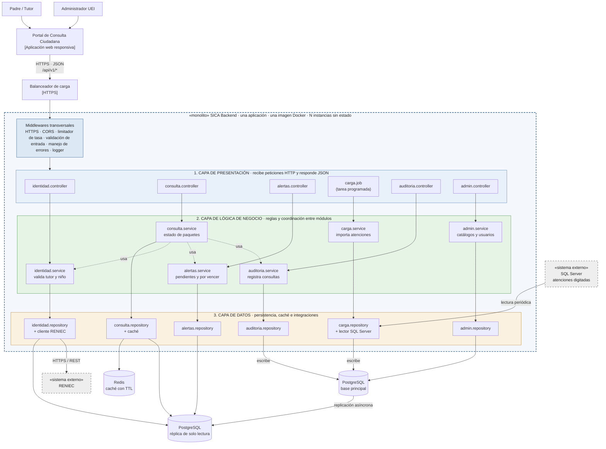

# Estilo arquitectónico

## Estilo seleccionado: Monolito modular en capas

| **Elemento** | **Descripción aplicada a SICA** |
|--------------|---------------------------------|
| **Estilo arquitectónico** | Monolito modular combinado con arquitectura en capas. |
| **Monolito** | Unidad de despliegue: todo el backend se construye y despliega como una sola aplicación (una imagen Docker). |
| **Modular** | Organización por dominio funcional: Identidad, Consulta de Paquetes, Alertas, Carga de Datos, Auditoría y Administración. |
| **En capas** | Organización lógica dentro de cada módulo: Presentación → Lógica de negocio → Datos. |
| **Decisión que lo respalda** | [ADR-001](../analisis-de-sistema/07-decisiones-arquitectonicas.md) |
| **Drivers que atiende** | DA01 – Escalabilidad, DA03 – Disponibilidad, DA08 – Evolución modular, DA09 – Portabilidad, DA10 – API REST. |

> **Capas** = organización lógica del código. **Monolito** = unidad de despliegue. Ambos conceptos coexisten: un monolito puede (y debe) estar organizado internamente en capas y módulos.

## Diagrama de arquitectura

**Leyenda:** flecha continua = llamada síncrona entre capas (de arriba hacia abajo); flecha punteada = uso entre módulos (solo a través de su *service*); caja discontinua = límite del monolito; «sistema externo» = fuera de SICA.

## Módulos del monolito

| **Módulo** | **Responsabilidad** | **Requisitos que cubre** |
|------------|---------------------|--------------------------|
| **Identidad** | Validar el DNI del padre/tutor y del niño, y la relación entre ambos (con RENIEC). | RF-01, RF-02 |
| **Consulta de Paquetes** | Obtener el estado de cumplimiento de cada paquete de atención integral (CRED, vacunas, hierro, tamizajes, visitas). | RF-03 |
| **Alertas** | Calcular las atenciones pendientes o próximas a vencer. | RF-04 |
| **Carga de Datos** | Importar periódicamente las atenciones desde SQL Server hacia PostgreSQL. | RF-06 |
| **Auditoría** | Registrar fecha, hora y resultado de cada consulta pública. | RF-07 |
| **Administración** | Gestionar catálogos, usuarios y reportes. | Actor Administrador UEI |
| **Transversal (middlewares)** | Limitador de tasa, HTTPS, validación de entrada, manejo de errores, logs. | RF-05 |

